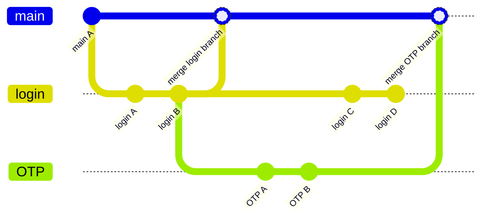

# 基礎知識

本文章以最簡短的說明帶領初學者了解 Git 基礎知識，首先介紹大的 picture 方便宏觀理解。

## Quick Overview

Git 是版本管理工具，紀錄版本的單位是一個一個的提交 (commit)，每個提交都會計算獨一無二的 hash 以紀錄版本變更，並且指向上次的提交，以便回溯過往提交。除了基本的提交歷史順序，還有一個重要的功能是分支 (branch)，分支的意思是從提交中分出支線，以便在支線進行功能開發/修復 bug 等工作，讓每個任務可以獨立作業不互相干擾，接著在開發完成後將分支整合[^merge]回主分支，這種機制使得不同開發人員能同時處理多個功能或修復任務，而不會影響<u>**主要分支的穩定性**</u>。

[^merge]: 避免誤導所以不說合併而說整合。因為 `git merge` 指令就是合併，然而我們可以使用 merge/rebase/cherry-pick 等方式完成整合工作，不限於 `git merge`。

上網查 git 時一定都看過這種流程圖，以本圖為例，從主分支切出 login 分支，OTP 分支又基於 login 分支進行開發，確認功能穩定可行後再合併[^combine]回 main，這樣的意義在於不影響穩定的主分支，即便在某個分支開發過程中出現問題，也不會影響到其他開發者的進度或整體系統的運行。

[^combine]: 此處的整合方式使用合併 `git merge`，這個方式會保留原始分支的完整歷史結構。

## 概念

實際使用時有三個層面，分別是你的硬碟、本地儲存庫 (git)、遠端儲存庫 (github/gitlab)。你的硬碟什麼版本都不知道，只儲存檔案當前狀態，儲存庫紀錄所有版本，遠端儲存庫是最後同步共享的地方。撰寫程式時，使用 `git commit` 提交到本地儲存庫，`git push` 推送提交到所有成員共用的遠端儲存庫進行協作開發。

為了簡化討論，我們暫時把遠端視為一個備份的存在。在本地端，Git 會把檔案標記為三種主要的狀態：已修改 modified、已預存 staged、已提交  committed。

1. 己修改 => 檔案被修改但尚未預存
2. 已預存 => 檔案將會被存到預存區，準備被提交
3. 已提交 => 檔案己安全地存在你的本地儲存庫

這張圖解釋了檔案的狀態，在「工作目錄（硬碟） Working Directory」中的檔案新增或修改後，使用 `git add` 放到暫存的空間「預存區 Staging Area」，修改到一定程度時使用 `git commit` 提交到「本地儲存庫 Repository」，使用 `git checkout` 把以前的版本簽出[^checkout]，放進「工作目錄」中。

[^checkout]: 官方將 checkout 翻譯為「簽出」。

> 此段落修改自[官方說明](https://git-scm.com/book/zh-tw/v2/%E9%96%8B%E5%A7%8B-Git-%E5%9F%BA%E7%A4%8E%E8%A6%81%E9%BB%9E)：三種狀態

## 關鍵字

初學時關鍵字中英混雜有點難記憶，每個人講的也不太一樣，這裡提供一些關鍵字關係對照：

| 狀態           | 位置                      | 相關指令        |   說明         |
|-------------- |-------------------------- |----------------|-------------- |
| 未追蹤/已修改   | 工作目錄 working directory | `git add`      | 存放到預存區    |
| 已預存         | 預存區 staging area        | `git commit`   | 提交到儲存庫    |
| 已提交         | 儲存庫 repository          | `git checkout`  | 取出到工作目錄  |
