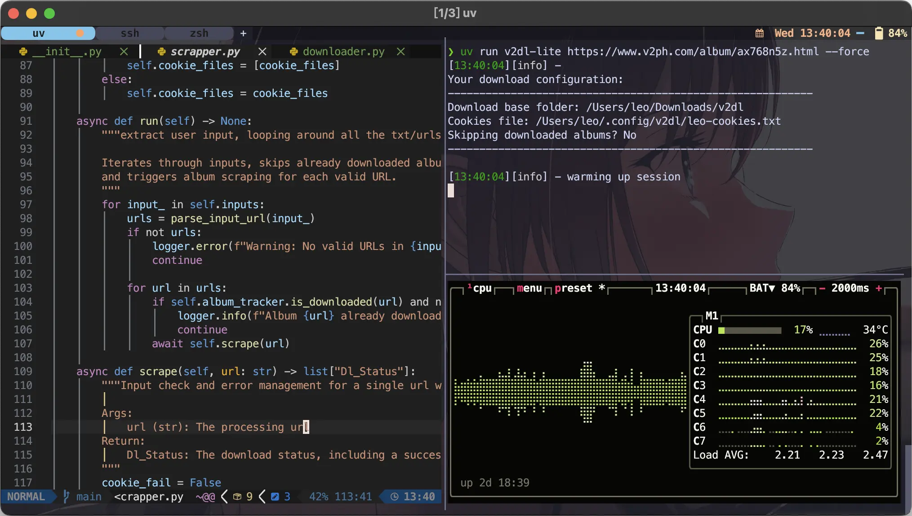

import ResponsivePlayer from '@site/src/components/ResponsivePlayer';

# 一鍵美化 MacOS 終端機

現代、快速、方便、功能齊全的 ZSH dotfile，[專案位址](https://github.com/ZhenShuo2021/dotfiles)。



<ResponsivePlayer url="https://www.youtube.com/watch?v=RVVCEYs4U7A" />

## 為何選擇這份 Dotfile

1. 是真的快，幾乎達到使用插件的速度上限，而且是嚴謹的測試不像網路上的搞笑演員拿 time 指令跑 10 次就說這叫做速度測試
2. 支援一鍵自動安裝
3. 管理方便，比 oh-my-zsh 更方便
4. 極簡風格，不搞花花綠綠的分散注意力
5. 你的套件管理器不會要你買 hoodies，不會一天到晚問你要不要更新
6. 你的終端機已經完整設定，一個字都不用打就已經是人家一整篇文章的設定
7. 你的 zshrc 已經最佳設定，是我過濾百篇文章的結晶
8. 完整註解，你絕對看得懂 zshrc 的每份設定
9. 設定正確，Zinit 正確使用延遲載入，自動補全正確啟用，連 zsh-z 都可以補全
10. 功能齊全，從語法上色、別名、key-binding、Git 插件一應俱全
11. 多項內建指令，如 hnc/c/gpg_test/gpg_reload/find-ext/switch_en ...
12. 不用搞什麼 gnu stow，純 Git 即可運作
13. 所有常見問題都已解決
14. 乾淨的家目錄，能改到 .cache/.config 的系統檔案全部改位置
15. 參考 Github 前 20 大 dotfiles 完成，結合他們全部優點，不用再想東想西現在就是最好的設定

網路上的繁體中文文章一堆設定錯誤，沒有啟用延遲載入、補全設定錯誤，在繁體中文圈甚至能把正確拿來當賣點，如果你照著其他繁體中文文章作高機率有某些功能設定錯誤。

## 速度

快不只是嘴上說說，也不只是表面數據。

採用全面且嚴謹的 [zsh-bench](https://github.com/romkatv/zsh-bench/) 作為測試指標，以反應現實狀態的指標得到真實可感知的效能提升，避免只有數據好看的問題，同時也提供直觀易懂的 hyperfine 測試結果[^test-method]。測試項目涵蓋五個常見框架：

[^test-method]: 測試執行於 M1 MacBook Pro 8G RAM，zsh-bench 使用預設值，hyperfine 使用 `hyperfine --runs 100 --warmup 3 'zsh -i -c exit 0'` 測試。由於不使用 zsh-defer 優化的 `Manual Install` 實在太慢，所以他沒有載入最耗時的幾個插件：oh-my-zsh 本身（借用他的插件庫，`Manual Install Optimized` 也有載入 oh-my-zsh 以達成公平的測試環境），以及需要載入 oh-my-zsh 的 docker/git 插件。總而言之所有框架的插件都相同只有 `Manual Install` 沒載入 oh-my-zsh 和 git/docker 插件。

- Oh-My-ZSH: 使用 Oh-My-ZSH 加上 zsh-defer 優化
- Manual Install: 手動安裝無優化
- Manual Install Optimized: 手動安裝加上 zsh-defer 優化
- Zinit: 本份 dotfile
- Baseline: 基準線，移除 .zshrc，本機能達到的最快速度

從最廣泛使用的框架到完全空白的設定檔，分別測試了最多人用的框架、純手動安裝、手動安裝極限優化、本份 dotfile 以及作為基準線的空白 zshrc，這樣選擇是為了能和絕大多數人的設定比較，並且和只有插件的 overhead 以及 shell 速度上限進行比對，以便更直觀了解效能定位在哪。


可以看到載入速度大幅領先 Oh-My-ZSH，並且大多數測試項目都能持平 `Manual Install Optimized` 甚至超越，請注意對手都公平的使用 zsh-defer 加速，表示已經非常接近速度上限了。比照基準線看似差距很多，但是根據 zsh-bench 作者的[感知閾值測試](https://github.com/romkatv/zsh-bench/?tab=readme-ov-file#how-fast-is-fast)，本份 dotfile 全部測試項目的耗時都能達到距離體感無延遲 10ms 之內的成績。

除了效能也更方便管理。由於採用 Zinit，不需要額外的設定文件來設定插件管理器，也不必像 Manual Install 那樣手動 clone 插件。

## 相容性

以下系統經過測試能正常運作，即使在權限被鎖定甚至連 dpkg 都不能用的 TrueNAS 都能成功啟用

- [x] macOS Sonoma
- [x] Ubuntu 22.04.5 LTS
- [x] TrueNas ElectricEel-24.10.0 (6.6.44-production+truenas)

## 安裝

```sh
git clone --recursive --shallow-submodules https://github.com/ZhenShuo2021/dotfiles ~/.dotfiles
cd ~/.dotfiles
find . -type f -name "*.sh" -exec chmod +x {} \; 
src/bootstrap.sh
```
