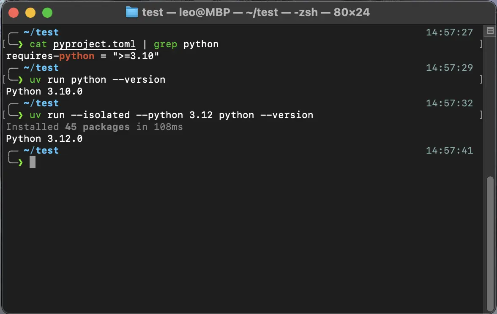

# UV Python完整教學：從安裝到發佈套件，最佳虛擬環境管理工具
本篇文章介紹 uv 的日常操作指令，從安裝到發布套件都包含在內，還有抄作業環節，直接複製貼上就能用，適合沒寫過 pyproject.toml 的人快速上手。如果不清楚自己是否該選擇 uv 請觀看[上一篇文章](/docs/python/virtual-environment-management-comparison)。

## 簡介
以一句話形容 uv，那就是完整且高效的一站式體驗。uv 是 2024/2 才首發的新工具，簡單摘要幾個特點：

1. 由 rust 撰寫，標榜快速，比 Poetry 快十倍以上
2. 使用 PubGrub 演算法[解析套件](https://docs.astral.sh/uv/reference/resolver-internals/)
3. **<u>完美取代 pip/pip-tools</u>**：支援 lockfile 鎖定套件版本
4. **<u>完美取代 pyenv</u>**：支援 Python 版本管理[^global]
5. **<u>完美取代 pipx</u>**：支援全域套件安裝
6. 發展快速，發布不到一年已經有 26k 星星

把特點 2\~4 加起來就是我們的最終目標了，有更好的套件解析演算法，既支援 lockfile 管理套件，又支援 Python 版本管理，也沒有 pipenv 速度緩慢且更新停滯的問題，是目前虛擬環境管理工具的首選。使用體驗非常流暢，和原本的首選 Poetry 互相比較，uv 內建的 Python 版本管理非常方便，不再需使用 pyenv 多記一套指令；本體雖然不支援建構套件，但是設定完 build-system 使用 `uv build` 和 `uv publish` 一樣可以方便的構建和發布；支援安裝全域套件，完美取代 pipx 管理全域套件；做了和 pip 類似的接口方便以往的使用者輕鬆上手，再加上[超快的安裝和解析速度](https://astral.sh/blog/uv-unified-python-packaging)錦上添花，筆者認為目前虛擬環境管理工具首選就是他了。

身為新穎又備受矚目的套件，目前的更新速度非常快，[兩個月就把問題解決了](https://www.loopwerk.io/articles/2024/python-uv-revisited/)。

為何選擇 uv？我會說：「一個工具完整取代 pyenv/pipx，幾乎包含 Poetry 的所有功能，速度又快」，這麼多優點是我可以一次擁有的嗎，太夢幻了吧。

[^global]: 只剩下等效於 `pyenv global` 的設定全局 Python 功能還不支援但[已經在規劃中](https://github.com/astral-sh/uv/issues/6265)。


## TL;DR
如果沒有要發布套件也沒有複雜的開發管理，只使用日常七騎士就可以使用 uv 完美取代舊有工具，不用看完整篇文章。

使用這七個指令即使不懂 pyproject.toml 也可輕鬆使用 uv，他會變成一個簡單、方便又超快的 venv + pip + pyenv 全能工具。

```sh
# 初始化工作區
uv init --python 3.10

# 建立虛擬環境，會根據工作區設定自動下載 Python
uv venv

# 新增套件
uv add

# 移除套件
uv remove

# 檢查套件
uv pip list

# 同步套件
uv sync

# 執行程式
uv run hello.py
```


## 前置作業

### 安裝 uv
https://docs.astral.sh/uv/getting-started/installation/

使用以下指令進行獨立安裝程式，其餘安裝方式請自行閱讀文檔。

```bash
# Unix
curl -LsSf https://astral.sh/uv/install.sh | sh

# Windows
powershell -ExecutionPolicy ByPass -c "irm https://astral.sh/uv/install.ps1 | iex"
```

### 設定 Python 版本
https://docs.astral.sh/uv/concepts/python-versions/  
https://docs.astral.sh/uv/guides/install-python/  

選用這種工具的用戶應該都需要管理多個 Python 版本，所以先從 Python 版本管理開始說明。

``` sh
# 安裝/移除指定版本
uv python install 3.12
un python uninstall 3.12

# 列出基本版本
uv python list

# 列出所有版本
uv python list --all-versions

# 只列出安裝版本
uv python list --only-installed

# 找到執行檔路徑
uv python find
```

### 初始化專案
https://docs.astral.sh/uv/reference/cli/#uv-init

設定好 Python 版本後就是初始化專案，使用 `app` 參數設定專案名稱，使用 `build-backend` 參數設定專案的構建後端，或是用 `uv init` 使用預設參數初始化專案。

```sh
uv init --app test --build-backend hatch --python 3.12
```


### 建立虛擬環境
https://docs.astral.sh/uv/pip/environments/ 

接下來是建立虛擬環境，名稱和 Python 版本都是可選參數非必要。

```sh
uv venv <name> <--python 3.11>
source .venv/bin/activate
```

## 套件管理
### 生產套件管理
https://docs.astral.sh/uv/concepts/projects/dependencies/

此處是有關套件處理相關的常用指令，熟記這些指令之後就可以替換掉 pyenv/poetry/pipx 了。

```sh
# 把套件加入 pyproject.toml 中
uv add

# 把套件從 pyproject.toml 中移除
uv remove

# 列出所有套件
uv pip list

# 基於 pyproject.toml 對目前環境中的套件進行同步，包含開發者套件
uv sync

# 同步但忽略開發者套件
uv pip sync pyproject.toml

# 同步虛擬環境，並且在虛擬環境中執行指令
uv run <commands>

# 更新 lockfile
uv lock

# 移除所有套件（只移除環境中的套件不會移除 toml 中的套件）
uv pip freeze > unins && uv pip uninstall -r unins && rm unins

# 升級指定套件或全部升級
uv sync --upgrade-package <package>
uv sync --upgrade

# 重新驗證套件快取，--fresh 在任何指令下都可使用
uv sync --refresh
```

### 開發套件管理
https://docs.astral.sh/uv/concepts/projects/dependencies/#development-dependencies

設定開發套件，此區域的套件不會被發布，可以使用 `--dev <pkg>` 新增，或者 `--group` 可以幫設定套件群組。


```toml
# toml 的設定：新版語法
[dependency-groups]
dev = ["pytest"]

# toml 的設定：舊版語法
[tool.uv]
dev-dependencies = ["pytest"]
```

使用 `uv sync` 和 `uv run` 時預設會同步生產套件和 dev 套件，修改 pyproject.toml 中的 default-groups 則可以設定 `uv  sync` 時同步的目標套件。有了 groups 後我們可以輕鬆的管理工具，例如使用 `uv run --no-group <foo-group> <your-commands>` 就可以在指定沒有 foo-group 的環境中執行指令。

```toml
# 設定 uv sync 只會同步 dev/foo 群組
[tool.uv]
default-groups = ["dev", "foo"]

# 在命令行中使用這個指令把 ruff 套件新增到 lint 群組
uv add --group lint ruff

# toml 中的對應的更新
[dependency-groups]
lint = ["ruff>=0.8.0"]
```

### 可選套件管理
https://docs.astral.sh/uv/concepts/projects/dependencies/#optional-dependencies

幫專案增加可選組件（可選組件：舉例來說，像是 httpx 的 http2 功能是可選）。

```toml
# 在命令行中使用這個指令，新增 matplotlib 為可選套件
uv add matplotlib --optional plot

# toml 中的對應的更新
[project.optional-dependencies]
plot = ["matplotlib>=3.6.3"]
```

### 重設環境中所有套件
https://docs.astral.sh/uv/pip/compile/#syncing-an-environment

把套件版本同步到生產版本。

```sh
# 同步txt
uv pip sync requirements.txt

# 同步toml
uv pip sync pyproject.toml

# 或者更乾淨的清除，這會刷新快取
uv sync --reinstall --no-dev

# 直接清除快取檔案
uv clean
```

### 使用 uv add 和 uv pip 安裝套件的差異
https://docs.astral.sh/uv/configuration/files/#configuring-the-pip-interface

`uv add` 用於正式專案套件，和 `uv remove` 成對使用，會修改 pyproject.toml；`uv pip` 則是臨時測試，不會寫入 pyproject.toml。

### 強大的 uv run 功能
https://docs.astral.sh/uv/concepts/projects/layout/  
https://docs.astral.sh/uv/guides/scripts/   
https://docs.astral.sh/uv/reference/cli/#uv-run   

有了 `uv run` 之後我們連虛擬環境都不需要進入。在每次 `uv run` 運行前他都會同步 pyproject.toml 中的套件再運行，除了自動同步功能以外也支援各種選項，例如我們可以使用 `--with-requirements` 設定這次執行要搭配哪些 requirements.txt，使用 `--no-sync` 可以關閉運行前的同步功能，使用 `--only-group` 設定只使用哪些群組的套件執行，最重要的是 `--python` 功能，允許我們指定使用不同的 Python 版本執行。

下方是一個基本範例，範例中先印出 pyproject.toml 指定的版本，再確認目前虛擬環境的版本，最後使用 `--python` 參數指定使用其他版本的 Python，非常方便。



如果某個地方需要特定 Python 版本，但是那裡又不想用 uv 管理，可以用取巧的方式達成，使用 `uv run --python 3.11 python -m venv .venv` 叫出 3.11 版本建立虛擬環境。

## 🔥 pyproject.toml 範例 🔥
既然 uv 的一站式體驗這麼好，那本文也提供一站式體驗，連 `pyproject.toml` 基礎範例都放上來提供參考，複製貼上後只需要使用 `uv sync` 就完成了，超級快。

```toml
# 假如拿到一個使用 uv 設定的專案架構如下
[project]
name = "your-project-name"
version = "0.1.0"
description = "project description"
readme = "README.md"
requires-python = ">=3.10"
dependencies = ["beautifulsoup4>=4.12.3", "requests>=2.32.3"]


[dependency-groups]
dev = [
    "mypy>=1.13.0",
    "ruff>=0.7.1",
    "pre-commit>=4.0.0",
    "pytest>=8.3.3",
    "isort>=5.13.2",
]

[project.optional-dependencies]
network = [
    "httpx[http2]>=0.27.2",
]

# 如果需要打包套件就使用這些
# [build-system]
# requires = ["hatchling"]
# build-backend = "hatchling.build"

# [tool.hatch.build.targets.wheel]
# packages = ["src/foo"]   # 佔位符

# 幫 cli 套件設定入口點
# https://docs.astral.sh/uv/concepts/projects/config/#entry-points
# [project.scripts]
# hello = "my_package:main_function"
```

以已經設定好的 toml 來說，uv 可以輕鬆完成 Python 版本下載和設定 + 虛擬環境建立 + 套件安裝。我們先看如果使用以往的 pyenv + poetry 組合需要使用這麼繁瑣的指令：

```sh
# 下載和設定版本
pyenv install 3.11.5
pyenv local 3.11.5

# 確認 Python 版本
python --version
poetry config virtualenvs.in-project true
poetry env use python3.11.5
# 或者使用 poetry env use $(pyenv which python)

# 安裝套件，啟動虛擬環境並且檢查
poetry install
poetry shell
poetry show
```

uv 用戶這時候已經去茶水間滑手機了，因為 uv 只要一行，而且 Poetry 的 "etry" 有夠難打每次敲快一點就打錯。

```sh
# 完成自動安裝 pyproject.toml 中的 Python 版本、建立虛擬環境、安裝開發和生產套件
uv sync

# 檢查
uv pip list

# 甚至可以連安裝都不要，clone 專案下來直接跑也會自動安裝
uv run <任意檔案>
```

## 發布套件

### 編譯 requirements.txt
https://docs.astral.sh/uv/pip/compile/

```sh
uv pip compile pyproject.toml -o requirements.txt
```

每次都要手動打太麻煩，使用 pre-commit 一勞永逸，自動檢查和匯出套件解析結果，pre-commit 的使用範例可以參考筆者寫的[文章](/memo/python/first-attempt-python-workflow-automation#pre-commit-configyaml)。

```yaml
# .pre-commit-config.yaml

repos:
  - repo: local
    hooks:
    - id: run-pip-compile
      name: Run pip compile
      entry: bash -c 'uv pip compile pyproject.toml -o requirements.txt'
      language: system
      files: ^pyproject.toml$
```

### 構建套件
https://docs.astral.sh/uv/reference/cli/#uv-build

```sh
uv build --no-sources
```

### 發布套件，以 test.pypi 為例
需要指定 build 路徑，預設在 dist 資料夾中。使用時輸入的帳號是 `__token__`，密碼則是 pypi 提供的 token，注意此指令還在實驗階段隨時可能變動。

```sh
uv publish --publish-url https://test.pypi.org/legacy/ dist/*
```

### 整合 Github CI
一般來說我們不會每次發布都打 build publish，而是使用自動化流程完成套件發布，下方直接附上 Github Actions 方便抄作業，實測沒問題可以直接複製貼上使用。這個設定使用新的[可信任發行者](https://docs.pypi.org/trusted-publishers/creating-a-project-through-oidc/)方式，在每次 [tag 或 release](https://stackoverflow.com/questions/61891328/trigger-github-action-only-on-new-tags) 時才會啟動，並且需要[手動雙重驗證](https://packaging.python.org/en/latest/guides/publishing-package-distribution-releases-using-github-actions-ci-cd-workflows/)。


```yaml
name: PyPI Publish

on:
  release:
    types: [created]

  push:
    tags:
      - 'v*.*.*'

jobs:
  publish:
    name: Build and Publish to PyPI
    environment: publish_pypi
    runs-on: ubuntu-latest

    permissions:
      id-token: write
      contents: read

    steps:
      - name: Checkout repository
        uses: actions/checkout@v4

      - name: Install uv
        uses: astral-sh/setup-uv@v4
        with:
          enable-cache: true
          cache-dependency-glob: uv.lock

      - name: Set up Python
        uses: actions/setup-python@v5.3.0
        with:
          python-version: '3.x'

      - name: Build package
        run: uv build

      - name: Publish to PyPI
        uses: pypa/gh-action-pypi-publish@release/v1
        # for test.pypi
        # with:
        #   repository-url: https://test.pypi.org/legacy/
```


## 使用 `uv tool` 取代 `pipx`
https://docs.astral.sh/uv/guides/tools/

此功能用於取代 pipx，把提供命令行執行的工具安裝在全局環境，例如我一開始只是想測試 uv 時也是用 pipx 安裝的。uv tool 特別的地方是沒有安裝也可以執行，會把套件安裝在一個臨時的虛擬環境中。

使用範例參考官方文檔

```sh
# 安裝 ruff
uv tool install ruff

# 執行 ruff，uvx 等效於 uv tool run ruff
uvx ruff

# 當套件名稱和命令行名稱不一樣時的指令
# 套件名稱 http，需要透過 httpie xxx 執行
uvx --from httpie http

# 升級
uv tool upgrade

# 指定相依套件版本
uv tool install --with <extra-package> <tool-package>
```

## 結束！
本文介紹了從安裝到平常使用，到 pyproject.toml/.pre-commit-config.yaml 抄作業，到發布套件，以及取代 pipx 全部介紹。由於這個工具很新隨時會變動，網路上資訊也少，如果有問題麻煩告知我再修正。

整體下來最心動的就是不需要 pyenv/pipx，也不用記 Poetry 有關 Python 解釋器的指令，全部都濃縮在 uv 一個套件中，加上執行速度快，更新很勤勞（2024/11 看下來每天都有 10 個 commit，嚇死人），社群狀態很健康 (競爭對手 [PDM is a one-man-show, like Hatch](https://chriswarrick.com/blog/2024/01/15/python-packaging-one-year-later/))，一個工具完整取代 pyenv/pipx，幾乎包含 Poetry 的所有功能，速度又快，難怪竄升速度這麼誇張。

筆者一向不喜歡寫這種純指令的文章，理由是網路已經充斥一堆類似文章了沒必要又一篇浪費讀者作者雙方時間，但是本文是全中文圈第一個完整介紹操作的文章所以沒這問題。
